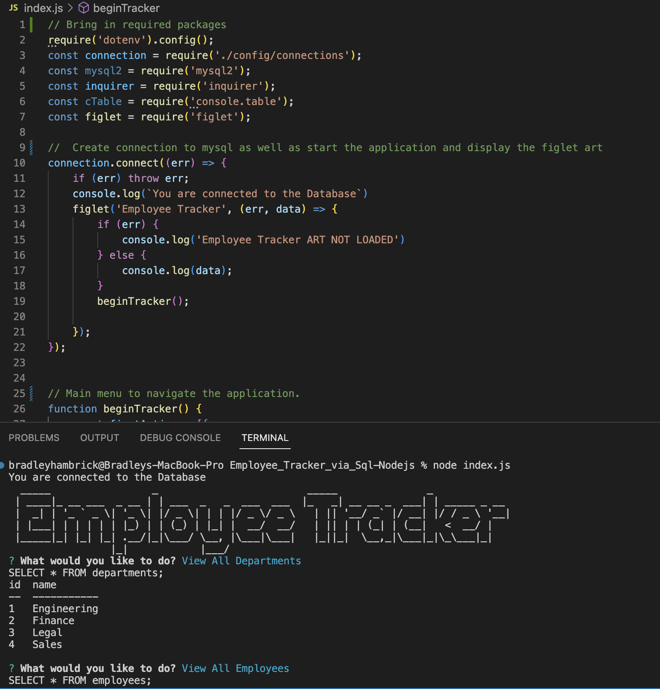
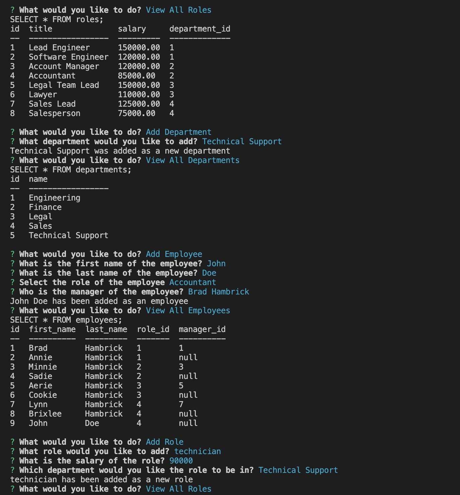
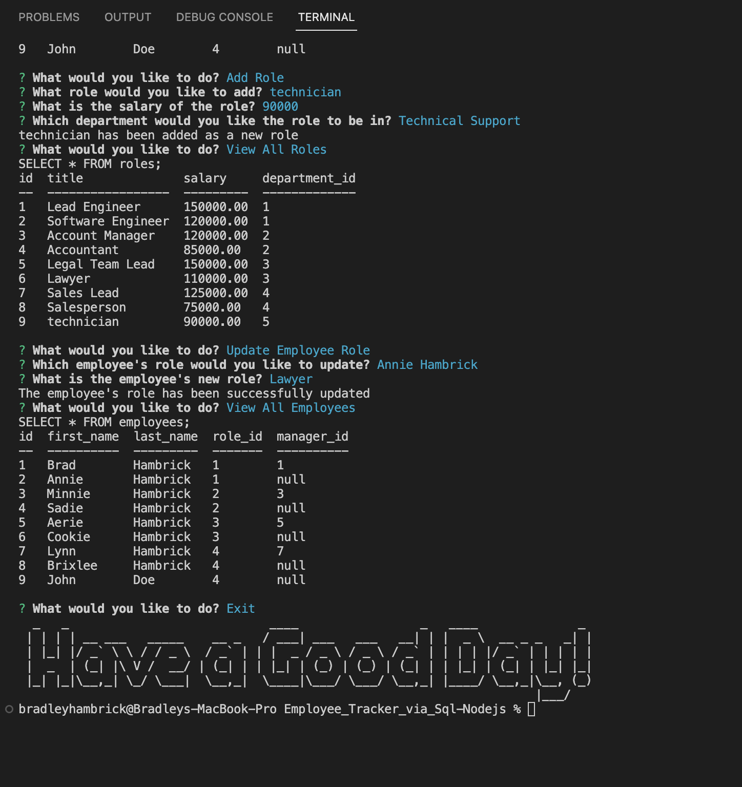

# Employee_Tracker_via_Sql-Nodejs
This application will give employers the ability to manage and organize their work units quickly and efficiently via a command line application

## GitHub Repository
[Employee_Tracker_via_Sql-Nodejs](https://github.com/Brad-Hambrick/Employee_Tracker_via_Sql-Nodejs)

##  Walk-through Video
[Employee_Tracker_via_Sql-Nodejs walk through video](https://drive.google.com/file/d/1xPsIHuevJHYiQv16c_EY7GCRyIpgC1zJ/view?usp=sharing)

## Description
This project was completed in order to showcase my knowledge using MySql and Nodejs.  This project is an employee tracker that gives users the ability to quickly and easily manage their work force.

## Badges
MySql by Oracle.

All of the coding methods in this project were those that were learned during the Vanderbilt Coding Bootcamp as well as some open source searches on mysql. This project also uses figlet for artwork and inquirer to collect user input.   

## Visuals

## Usage
This project was created to showcase my ability to work with node and mysql to create an app that can manage and manipulate back end data. 

## Support
For support, contact Brad Hambrick @bradleyhambrick@gmail.com

## Roadmap
This project is built to a point of basic functionality however could have several more features added such as ways to search for employee data.  It may also recieve additional attributes added to employess.    

## Contributing
This project is open to recommendations and future contributions.

## Authors and acknowledgment
Thanks to Vanderbilt Coding Bootcamp for contributing to the knowledge required to build this project.

## License
In this project mysql is used to manage the data.  Figlet is used to add some eye appeal to the project and Inquirer was used to accept user input.    

## Project status
The project is still in the early phases and will be getting future improvements and alterations.